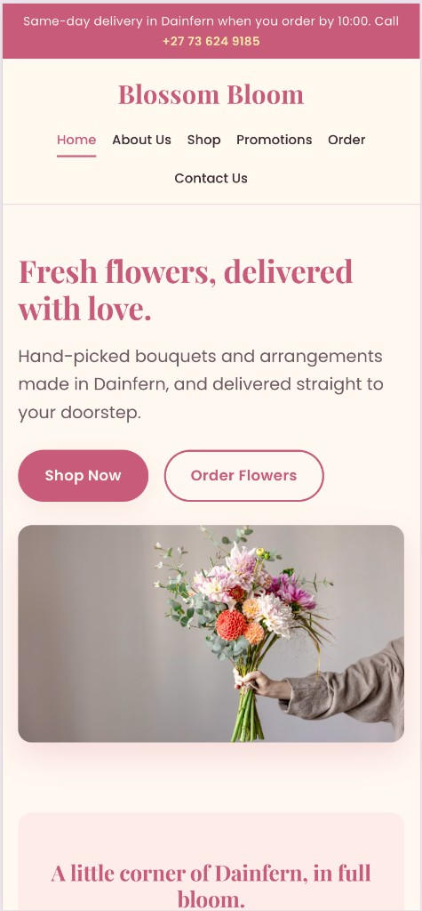
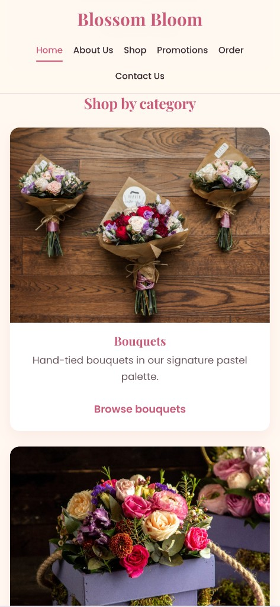
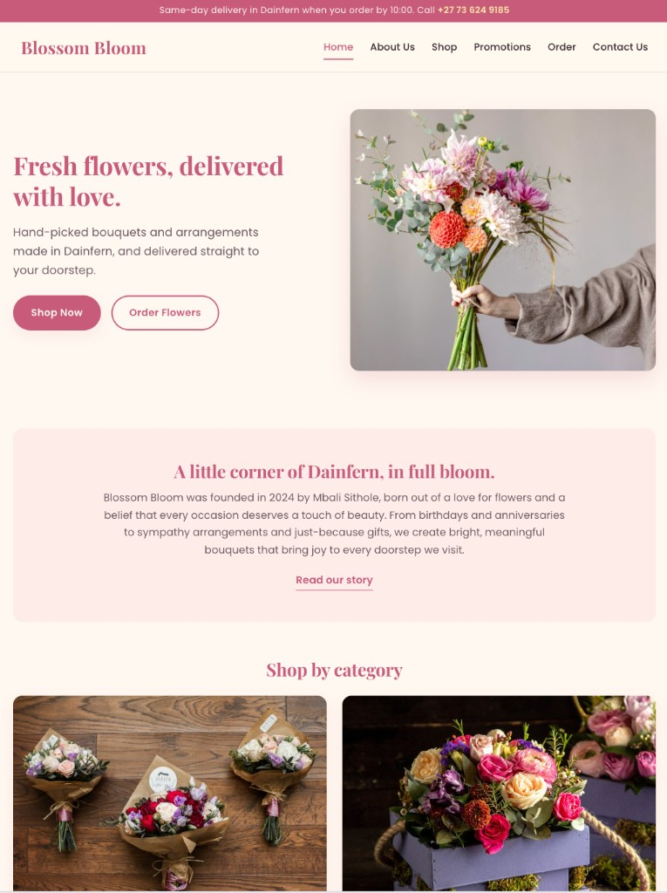
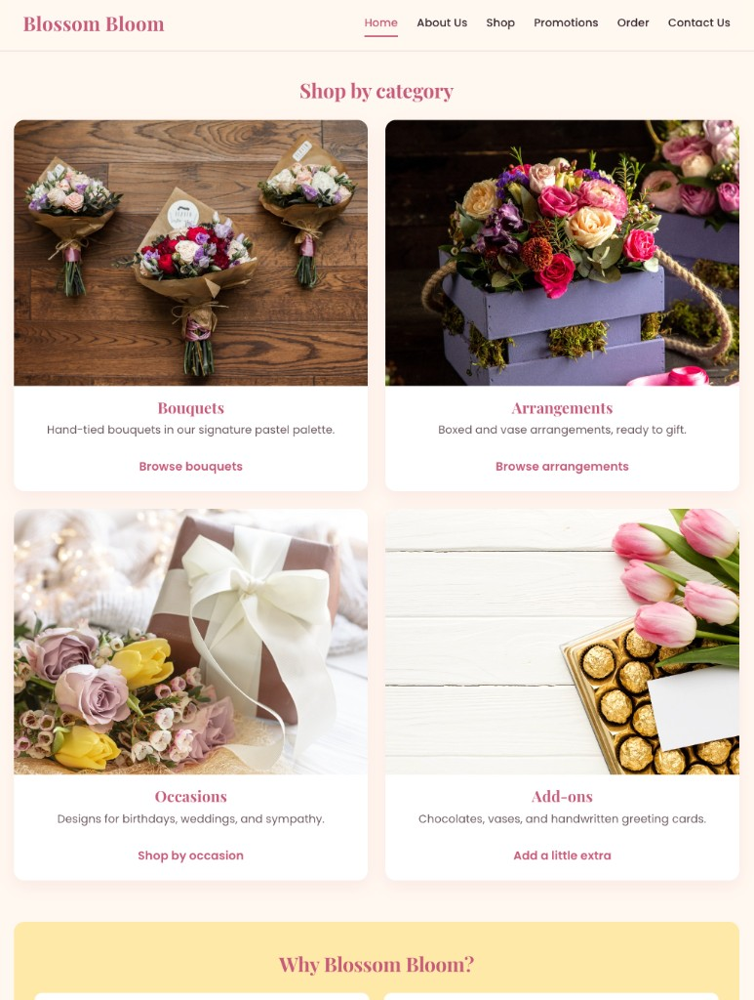
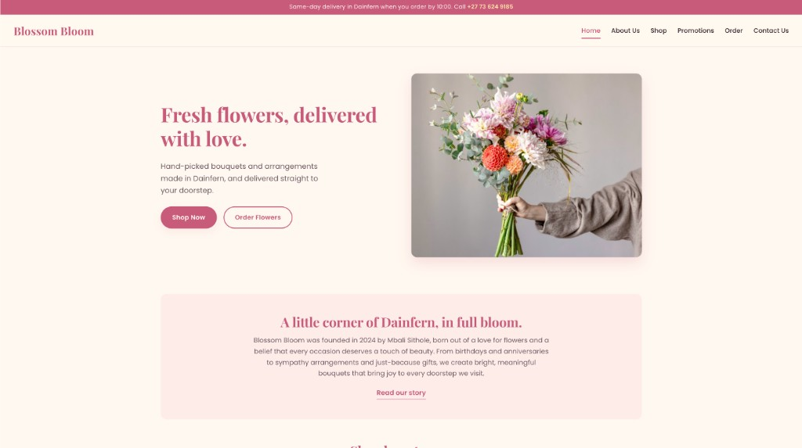
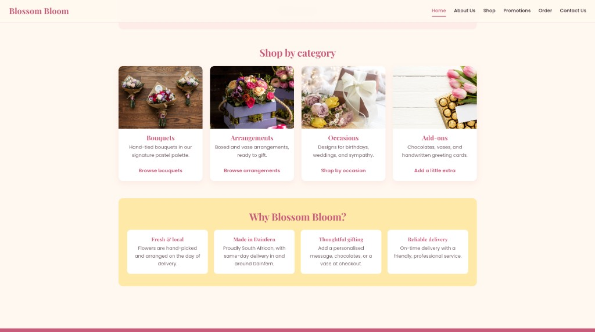

# Blossom Bloom Website

A web development project for the WEDE5020W module, building the first online home for **Blossom Bloom**, a Dainfern-based flower shop.

---

## Student Information

- **Full Name:** Sphiwe T Zwane
- **Student Number:** ST10534768
- **Module:** WEDE5020W (Web Development)

---

## Project Title

**Blossom Bloom | Fresh Flowers Delivered in Dainfern**

---

## Project Overview

Blossom Bloom is a local flower shop founded in 2024 by Mbali Sithole in Dainfern, South Africa. The business was born out of a love for flowers and a belief that every occasion deserves a touch of beauty. What began as a small home-based venture, creating bouquets for friends and family, quickly grew as word spread about the freshness, creativity, and care behind each arrangement. Today, Blossom Bloom delivers fresh, hand-picked flowers straight to doorsteps across the community.

The business currently has no online presence. This project creates the first official Blossom Bloom website, giving the brand a digital home where customers can:

- Learn about the story, values, and people behind the brand.
- Browse fresh bouquets, arrangements, occasion flowers, and gift add-ons.
- See current seasonal promotions and special offers.
- Place orders, choose delivery details, and add personalised messages.
- Get in touch by email, WhatsApp, contact form, or social media.

The website is being built as a three-part academic project:

- **Part 1:** HTML structure and basic content (this submission, due 28 April 2026).
- **Part 2:** Styling and responsive design (due 29 May 2026).
- **Part 3:** Interactivity, SEO, and launch (due 19 June 2026).

---

## Website Goals and Objectives

The Blossom Bloom website is designed to meet the following goals:

- **Build brand awareness** by introducing Blossom Bloom to a wider audience in Dainfern and surrounding areas, and clearly communicating the brand's story, values, and unique style of floral design.
- **Drive online sales** by providing customers with a simple, secure, and convenient platform to browse, order, and pay for flower arrangements online.
- **Showcase products and creativity** through a visually appealing gallery of bouquets and arrangements that highlight the creativity, freshness, and quality Blossom Bloom is known for.
- **Provide a seamless customer experience** by ensuring customers can easily navigate the site, place orders, and receive confirmation without friction, on any device.
- **Build customer trust and loyalty** through testimonials, a clear returns and refund policy, and responsive contact channels that encourage confidence and repeat orders.
- **Support marketing and communication** by serving as a central hub for promotions, seasonal campaigns, and for collecting customer emails or WhatsApp contacts for future marketing.

### Key Performance Indicators

- **Total website visits:** grow by 15% month on month in the first 6 months.
- **Conversion rate:** at least 2% to 3% of visitors placing an order.
- **Average order value:** R450 or higher.
- **On-time delivery rate:** 95% or higher.
- **Customer satisfaction score:** 4.5 out of 5 or higher.
- **Repeat purchase rate:** 25% within the first year.

---

## Key Features and Functionality

### Essential Pages

- **Homepage (`index.html`)**: Hero bouquet, warm brand intro, featured categories, and trust points.
- **About Us (`about.html`)**: Founding story, founder introduction, mission, and vision.
- **Shop (`shop.html`)**: Dynamic product categories for Bouquets, Arrangements, Occasions, and Add-ons, with images, descriptions, and prices in ZAR.
- **Promotions (`promotions.html`)**: Featured promotion banner, seasonal campaigns (Mother's Day, Valentine's Day, Spring Day, Birthdays), loyalty programme, and sign-up for WhatsApp and email deals.
- **Order & Delivery (`order.html`)**: Cart summary, delivery address, date and time selection, personalised gift message, and PayFast or Yoco payment options.
- **Contact (`contact.html`)**: Contact form, email, WhatsApp, operating hours, embedded Google Map of the Dainfern delivery area, and social media links.

### Planned Functionality

- Mobile responsiveness for easy browsing on any device.
- "Add to Cart" and secure online checkout for flower orders.
- Google and Apple Maps integration for the Dainfern delivery area.
- Contact form and WhatsApp chat integration.
- Social media links to Instagram, Facebook, and TikTok.
- Personalised message option at checkout for gifting.

---

## Design and User Experience

### Colour Palette

Inspired by fresh flowers and pastel blooms:

| Colour | Hex | Usage |
| --- | --- | --- |
| Blossom Pink | `#F4A6C0` | Primary brand colour |
| Soft Petal Yellow | `#FFE9A8` | Accent |
| Pastel Lavender | `#D8C8F0` | Secondary elements |
| Creamy Ivory | `#FFF8F0` | Backgrounds |
| Deep Rose | `#C75B7A` | Text and call-to-action buttons |

### Typography

- **Headings:** Playfair Display (elegant serif).
- **Body text:** Poppins or Lato (clean sans-serif).

### UX Principles

- Simple, warm, and easy to order.
- Fully optimised for mobile devices.
- Strong contrast between text and backgrounds for readability.
- Consistent branding across all pages.

---

## Technical Requirements

- **Languages and tools:** HTML5, CSS3 (CSS Grid, Flexbox, custom properties, media queries), and JavaScript (Part 3).
- **Fonts:** Google Fonts, Playfair Display for headings and Poppins for body copy.
- **Hosting:** HostAfrica (Starter plan).
- **Domain:** `www.blossombloom.co.za`.
- **Payments (planned):** PayFast or Yoco.

---

## Timeline and Milestones

The project runs from 23 February 2026 through to 19 June 2026.

### Part 1: Foundation and HTML Build (Due 28 April 2026)

- **Week 1 (23 Feb 2026):** Submit proposal, research business, set up folder structure, create GitHub repo.
- **Week 2 (02 Mar 2026):** Plan content and sitemap, create wireframes, source royalty-free imagery.
- **Week 3 (09 Mar 2026):** Build HTML structure for Home, About, Shop, Promotions, Order, and Contact pages.
- **Week 4 (16 Mar 2026):** Refine and validate HTML, build navigation menu, insert base content and images.
- **Week 5 (20 Apr 2026):** Final HTML testing, browser checks, validation, comments, README, submit Part 1.

### Part 2: Styling and Responsive Design (Due 29 May 2026)

- **Week 6 (26 Apr 2026):** External stylesheet, CSS reset, Blossom Bloom pastel palette and typography.
- **Week 7 (05 May 2026):** Desktop layouts with CSS Grid and Flexbox, visual effects, hover states.
- **Week 8 (12 May 2026):** Media queries, mobile and tablet versions, image optimisation.
- **Week 9 (19 May 2026):** Cross-device testing, responsive polish, submit Part 2.

### Part 3: Interactivity, SEO, and Launch (Due 19 June 2026)

- **Week 10 (26 May 2026):** Lightbox galleries, FAQ accordions, begin order and contact form validation.
- **Week 11 (02 Jun 2026):** Accessibility, speed, SEO, animations, `robots.txt`, XML sitemap, screen reader testing.
- **Week 12 (09 Jun 2026):** Map integration, final form wiring, image optimisation, full walkthrough, submit Part 3.

---

## Submission Details

This README covers **Part 1 (HTML build)** and **Part 2 (styling and responsive design)**. Part 3 (interactivity, SEO, and launch) will be added in the final submission.

Part 1 includes:

- Full HTML5 structure for all six pages (Home, About, Shop, Promotions, Order, Contact).
- Semantic HTML5 elements such as `<header>`, `<nav>`, `<main>`, `<section>`, `<article>`, and `<footer>`.
- Essential content tags including `<h1>` to `<h3>` headings, `<p>`, ``, `<a>`, `<ul>`, `<form>`, and `<table>`.
- A working navigation menu that links every page to every other page.
- Base textual content for each page, based on the Content Research and Sourcing document.
- Comments throughout the code describing each major section.
- Properly indented, readable HTML.
- Placeholders for CSS (Part 2) and JavaScript (Part 3) folders.

---

## Sitemap

```
Blossom Bloom Website
│
├── Homepage (index.html)
│   ├── Hero section
│   ├── Brand introduction
│   ├── Featured categories
│   └── Why Blossom Bloom
│
├── About Us (about.html)
│   ├── Founding story
│   ├── Meet the founder
│   └── Vision and mission
│
├── Shop (shop.html)
│   ├── Bouquets
│   ├── Arrangements
│   ├── Occasions
│   └── Add-ons
│
├── Promotions (promotions.html)
│   ├── Featured promotion
│   ├── Current promotions
│   └── WhatsApp and email sign-up
│
├── Order & Delivery (order.html)
│   ├── Cart summary
│   ├── Delivery details
│   ├── Personalised message
│   ├── Payment
│   └── How delivery works
│
└── Contact (contact.html)
    ├── Contact details
    ├── Contact form
    ├── Delivery area map
    └── Social media
```

### File and Folder Structure

```
Blossom Bloom Website by ST10534768/
│
├── index.html
├── about.html
├── shop.html
├── promotions.html
├── order.html
├── contact.html
├── README.md
│
├── css/
│   └── style.css     (single external stylesheet for the whole site)
├── js/               (to be populated in Part 3)
│
└── images/         (all image assets stored directly in this folder)
    └── screenshots/  (responsive testing screenshots for the README)
```

---

## Responsiveness Testing and Iteration Across Devices

These screenshots show how the site responds on common devices after iterative testing and adjustments. The layout was checked around the two CSS breakpoints (1024px and 640px) using browser developer tools, and the design was adjusted until it read well on each screen size.

### Mobile

iPhone 14 Pro Max (430 x 932)





### Tablet

iPad Pro (1024 x 1366)





### Desktop

Samsung S33GF 24" (1920 x 1080)





---

## Changelog

### Part 2, Version 1.2 (May 2026)

**Visual refinements and layout updates** building on the v1.1 styling pass, based on review of the live pages.

**Added**

- **Announcement bar:** a slim full-width bar above the navigation on every page, showing the same-day delivery cut-off and the shop phone number.
- **Expanded footer:** the simple social footer is now a four column footer with a brand blurb, a Help links column, a Quick Links column, and a Connect column with phone, email, and social links, plus a centred bottom bar with delivery note and copyright. The footer collapses to two columns on tablet and a single centred column on mobile.
- **Product card hover effect:** product images now gently zoom on hover, and product name, description, size, and price are centred for a cleaner card layout.

**Changed**

- **Hero image:** the homepage hero now uses a `5 / 4` aspect ratio with `object-position: right center` so the full bouquet is in frame instead of being cropped to the empty side of the photo. On mobile it uses a `16 / 9` frame.
- **Shop product images:** switched from a `4 / 3` crop to a `1 / 1` square so less of each photo is cut off while still filling the card with no side gaps.
- **Promotion card images:** switched from a fixed pixel height to a `4 / 3` aspect ratio so the promo photos show more of the arrangement and stay uniform across cards.
- **Section backgrounds:** the Meet Mbali Sithole, Our Vision, Our Mission, Ready to Send Some Joy, Featured Mother's Day Blooms, and Connect With Us blocks now use a single solid Blossom Pink background instead of gradients and pastel tints, matching the sign-up section.
- **Vision and Mission cards:** removed the coloured top accent border and drop shadow for a flatter, cleaner look.
- **Contact detail cards:** removed the heavy left accent border and drop shadow, leaving a light bordered card.
- **Responsiveness across mobile, tablet, and desktop:** reviewed and tuned the layout at each breakpoint after testing on real device sizes.
    - Tablet (up to 1024px): tightened the header and navigation spacing so all six links sit on one row, stacked the featured promotion banner so the image and text are no longer cramped, and changed the Order page (cart and form) and Contact page (form and map) to stack into a single column for more room.
    - Mobile (up to 640px): tidied the stacked navigation spacing, reduced the featured promotion padding, and allowed the cart table to scroll sideways so it can never widen the page.
    - Added `overflow-x: hidden` on the body as a safety net so no element can trigger a horizontal scrollbar at any screen size.

**Removed**

- **Gold Cage Dome arrangement:** removed the full product card from the Shop page, including its image, name, description, size options, and price.  

### Part 2, Version 1.1 (May 2026)

**Alignment with the proposal (WEDE5020W, Part 2, styling and responsive design, due 29 May 2026):** this release adds the full visual layer to the Blossom Bloom site. The HTML built in Part 1 is now styled with a single external CSS file that applies the brand palette and typography, lays the pages out using CSS Grid and Flexbox to match the agreed wireframes, and adapts the design from desktop down to tablet and mobile.

**Shipped in v1.1**

- **External stylesheet (`css/style.css`):** linked from every HTML page using a consistent path. No inline styles or internal `<style>` blocks remain. Replaces the original plan to use Tailwind, since the brief requires a single hand-written external CSS file.
- **CSS reset and base styles:** universal `box-sizing: border-box` reset, removal of default margins and padding, and a baseline body font, font size, line height, text colour, and background colour drawn from the Blossom Bloom palette.
- **Brand palette as CSS custom properties:** Blossom Pink `#F4A6C0`, Soft Petal Yellow `#FFE9A8`, Pastel Lavender `#D8C8F0`, Creamy Ivory `#FFF8F0`, and Deep Rose `#C75B7A` exposed as variables on `:root` and reused throughout the stylesheet for backgrounds, text, borders, and shadows.
- **Typography:** Google Fonts loaded for Playfair Display (headings) and Poppins (body). Heading hierarchy from H1 through H4 is applied with a clear typography scale, plus consistent `font-weight`, `line-height`, and `letter-spacing` across paragraphs, buttons, and form labels.
- **Sticky navigation:** the site header now stays fixed at the top of every page using `position: sticky`, with a translucent ivory background and subtle border. The active page is highlighted using the existing `aria-current="page"` attribute. Nav labels updated to match the brief: Home, About Us, Shop, Promotions, Order, Contact Us.
- **Wireframe-aligned page layouts using CSS Grid and Flexbox:**
    - **Homepage:** the hero is a two column grid with the tagline and Shop Now and Order Flowers buttons on the left, and the bouquet hero image on the right at a minimum height of 400px. Featured categories use a four column grid, and the trust block uses a four column flex-style grid of trust points.
    - **About Us:** the founding story is a two column grid with the founder image of Mbali Sithole on the left, vertically centred in its cell, and the Our Story body text on the right. The vision and mission live in a two equal column grid below.
    - **Shop:** a full-width category tab bar with four pill-shaped tabs sits above the products. Each category renders as a three column product grid where every card has a uniform image height (`aspect-ratio: 4 / 3`), product name, price, and Add to Cart button.
    - **Promotions:** featured promotion banner styled as a two column gradient banner. Current promotions sit in a two column promo grid, with consistent image heights across all cards.
    - **Order and Delivery:** body class `page-order` makes the cart summary and delivery form sit side by side on desktop using grid, with the page heading and the How delivery works panel spanning the full width.
    - **Contact:** body class `page-contact` puts the contact form on the left and the embedded Google Map on the right. A new full-width social links bar with WhatsApp, Instagram, Facebook, and Email sits above the footer to match the wireframe.
- **Visual styling and interactivity:** soft `box-shadow` lift on cards, rounded corners, gradient banners, and pill-shaped buttons. All buttons, nav links, form fields, and cards have `:hover`, `:focus`, and `:active` styles. CTA buttons use Deep Rose `#C75B7A` with a deeper rose hover state and a small upward translate on focus and hover.
- **Forms:** consistent input, select, textarea, and checkbox styling, with rose focus rings and accessible focus outlines. The promotions sign-up form uses a two column grid that collapses on mobile, and the order checkout form uses styled `fieldset` and `legend` groups.
- **Image handling:** all images use `object-fit: cover` so they fill their containers without stretching. Product cards, category cards, and promo cards use `aspect-ratio` to keep heights uniform. The hero, founder, and promotion images all scale fluidly with their containers and remain crisp on tablet and mobile.
- **Responsive design with three breakpoints:**
    - Desktop (above 1024px) keeps the full multi-column wireframe layouts.
    - Tablet (up to 1024px) drops most grids to two columns and reduces heading sizes.
    - Mobile (up to 640px) collapses every multi-column layout to a single column, restacks the header and nav vertically, scales typography down, and stacks the social bar and external map links.
- **Relative units:** sizes use `rem`, `em`, and `%` throughout for typography, spacing, and widths, so the layout scales cleanly with the user's browser font size.
- **Part 1 corrections folded in:**
    - Replaced the missing `images/occasion-sympathy.jpg` reference on the Shop page with the existing `bouquet-cream-lilies.png`, with an updated alt description suited to a sympathy arrangement.
    - Replaced the missing `images/promotion-loyalty.jpg` reference on the Promotions page with the existing `addon-card.png`, since loyalty cards visually fit the handwritten card image.
    - Renamed the Shop page heading from "Shop Blossom Bloom" to "Flower Shop" and the About page heading to "About Us" to match the wireframe headings exactly.
    - Lifted the shop category quick links out of the page intro into a top-level `nav.category-nav` so it can be styled as the full-width category tab bar shown on the wireframe.
    - Removed the inline `style="border:0;"` from the Google Maps `iframe` on the Contact page since the brief disallows inline styles. The same border removal is now handled in `style.css`.
    - Updated nav labels to "Order" and "Contact Us" across every page so they match the wireframe link copy and the brand identity brief.

**Not in v1.1 (planned for Part 3):** real cart behaviour, JavaScript form validation, lightbox galleries, FAQ accordions, full SEO and `robots.txt` and XML sitemap work, and final launch tasks.

### Part 1, Version 1.0 (April 2026)

**Alignment with the proposal (WEDE5020W, Part 1, HTML structure and basic content, due 28 April 2026):** this release delivers the first official Blossom Bloom web presence for the Dainfern-based shop, matching the **Essential Pages** and **Part 1 Details** scope: full HTML5 structure, semantic layout, cross-page navigation, and base copy so customers can learn about the brand, browse products in ZAR, see promotions, start an order flow, and get in touch (including map and contact form markup).

**Shipped in v1.0**

- Set up project folder, flat `images/` asset folder (royalty-free product and brand images), and empty `css/` and `js/` folders for Part 2 and Part 3.
- **Home (`index.html`):** hero, brand introduction, featured categories, trust and why-us content.
- **About (`about.html`):** founding story, founder, mission, vision, and values.
- **Shop (`shop.html`):** Bouquets, Arrangements, Occasions, and Add-ons with images, short descriptions, and ZAR prices (the proposal's "browse and showcase products" baseline).
- **Promotions (`promotions.html`):** featured promotion, seasonal campaigns (Mother's Day, Valentine's Day, Spring, birthdays), loyalty messaging, sign-up for deals.
- **Order (`order.html`):** cart-style summary, delivery details, personal message, PayFast or Yoco options as planned payment labels (no live payment integration in Part 1).
- **Contact (`contact.html`):** contact form, email, WhatsApp, hours, embedded Google Map (Dainfern area), social links.
- Site-wide header and nav linking all six pages, plus a footer with contact and socials.
- Semantic HTML5 where appropriate (`header`, `nav`, `main`, `section`, `article`, `footer`), with headings, paragraphs, images, links, lists, forms, and tables as required for Part 1.
- HTML comments on major sections, and a README with student info, goals, timeline, sitemap, and this changelog.

**Not in v1.0 (planned for later parts):** external stylesheet (Part 2), responsive polish, real checkout and cart behaviour, JS form validation, SEO, and full launch tasks (Part 3).

---

## References

ColorHunt, n.d. *Color Palettes for Designers and Artists*. [Online]. Available at: https://colorhunt.co [Accessed 27 March 2026].

CSS-Tricks, n.d. *A Complete Guide to CSS Grid*. [Online]. Available at: https://css-tricks.com/snippets/css/complete-guide-grid [Accessed 06 May 2026].

CSS-Tricks, n.d. *A Complete Guide to Flexbox*. [Online]. Available at: https://css-tricks.com/snippets/css/a-guide-to-flexbox [Accessed 06 May 2026].

Flaticon, n.d. *Free Icons Library*. [Online]. Available at: https://www.flaticon.com [Accessed 16 April 2026].

FreePik, n.d. *Flower Business Images*. [Online]. Available at: https://www.freepik.com/app [Accessed 16 April 2026].

Google Fonts, n.d. *Free Fonts Library*. [Online]. Available at: https://fonts.google.com [Accessed 27 March 2026].

Google Maps Platform, n.d. *Embed a Map*. [Online]. Available at: https://developers.google.com/maps/documentation/embed/get-started [Accessed 22 April 2026].

HostAfrica, n.d. *Web Hosting in South Africa, Fast, Reliable and Secure*. [Online]. Available at: https://hostafrica.co.za/web-hosting/#hosting-plans [Accessed 02 April 2026].

MDN Web Docs, n.d. *CSS Custom Properties (Variables)*. [Online]. Available at: https://developer.mozilla.org/en-US/docs/Web/CSS/Using_CSS_custom_properties [Accessed 09 May 2026].

MDN Web Docs, n.d. *Media Queries for Standard Devices*. [Online]. Available at: https://developer.mozilla.org/en-US/docs/Web/CSS/CSS_media_queries [Accessed 12 May 2026].

MDN Web Docs, n.d. *Responsive Web Design*. [Online]. Available at: https://developer.mozilla.org/en-US/docs/Learn/CSS/CSS_layout/Responsive_Design [Accessed 12 May 2026].

MDN Web Docs, n.d. *Sticky Positioning*. [Online]. Available at: https://developer.mozilla.org/en-US/docs/Web/CSS/position#sticky_positioning [Accessed 09 May 2026].

W3C, n.d. *Web Content Accessibility Guidelines (WCAG) 2.1*. [Online]. Available at: https://www.w3.org/TR/WCAG21 [Accessed 16 May 2026].

---
